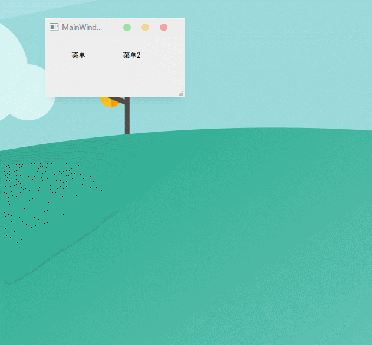

FacileMenu
====

## 介绍

一款非常非常飘逸的 Qt 菜单控件，带有各种动画效果，用起来也十分方便。

可替换 Qt 自带的菜单

## 简单使用

1. 放入源代码
   将 `facile_menu` 文件夹放入 Qt 程序，pro 文件的 `INCLUDEPATH` 加上对应路径，`resources` 里的资源文件 `sub_menu_arrow.png` （子菜单箭头）也导入

2. 包含头文件
   `#include "facile_menu.h"`

3. 创建并显示菜单

   ```C++
   // 创建菜单
   FacileMenu* menu = new FacileMenu(this);
   
   // 添加动作
   menu->addAction(QIcon(":/icons/run"), "开始播放 (&S)", [=]{
       /* 某操作 */
   })->tip("Ctrl+S")->disable()->hide();
   
   // 显示菜单
   menu->execute(QCursor::pos());
   ```

   ## 常用功能

   ### 连续设置

   ```C++
   menu->addAction(QIcon(":/icons/run"), "开始播放 (&S)", [=]{})
       ->tip("Ctrl+S")
       ->disable(/*如果满足某条件(默认true)则disable，下同*/)
       ->hide(/*条件表达式*/)
       ->setChecked(false);
   ```

   ### 子菜单

   ```C++
   auto subMenu = menu->addMenu("子菜单2");
   
   subMenu->addAction("继续", [=]{});
   
   subMenu3->addAction("停止", [=]{})
       ->disable(!playing);
   ```

   ### 横向菜单

   ```C++
   menu->addChipLayout(); // 添加横向布局，之后才能使用 addChip
   menu->addChip("按钮1");
   menu->addChip("按钮2")->disable();
   menu->addChip(QIcon(":/icons/appicon"));
   ```

   ### 导入QAction

   支持在菜单关闭时自动 delete 传入的 delete，避免内存泄漏

   ```C++
   QAction* action = ...;
   menu->addAction(action, true/*是否在菜单关闭一起时delete action*/);
   ```

   

## 截图

